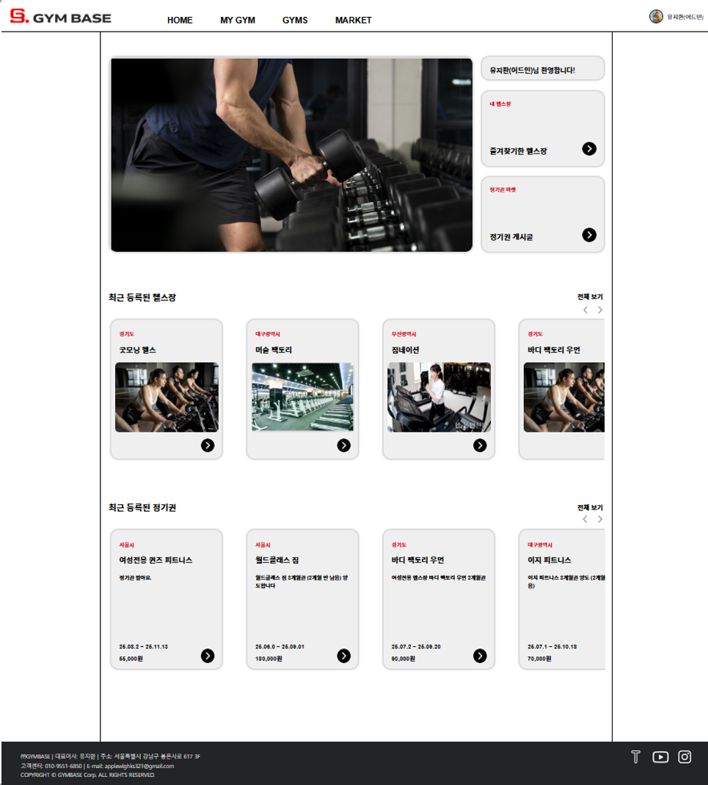
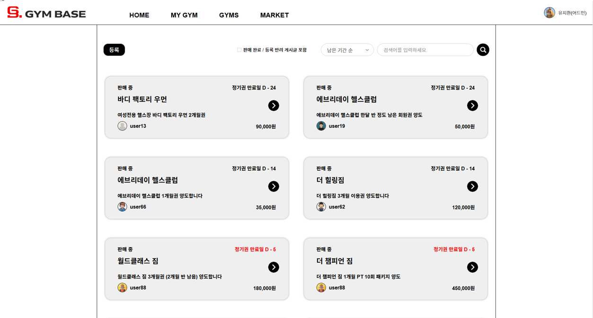
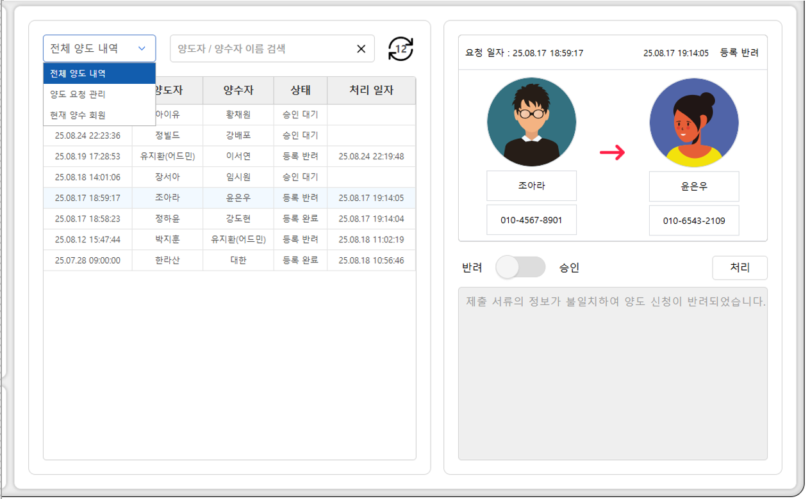
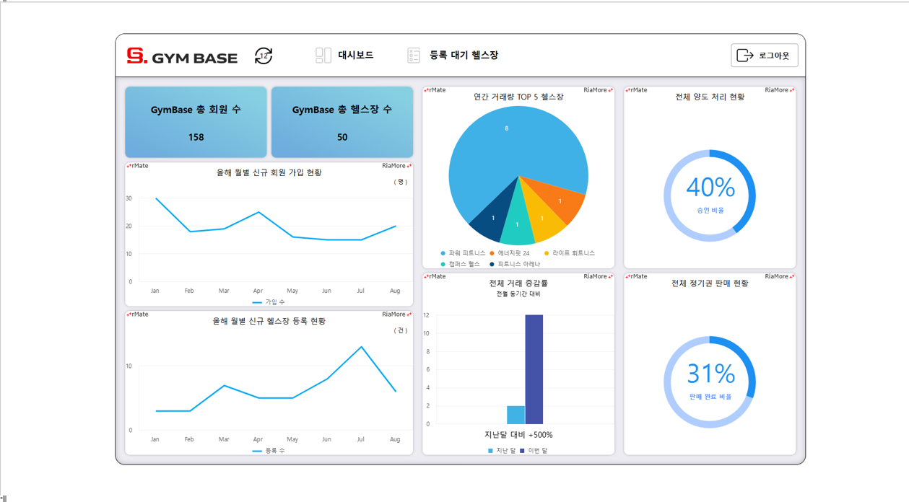
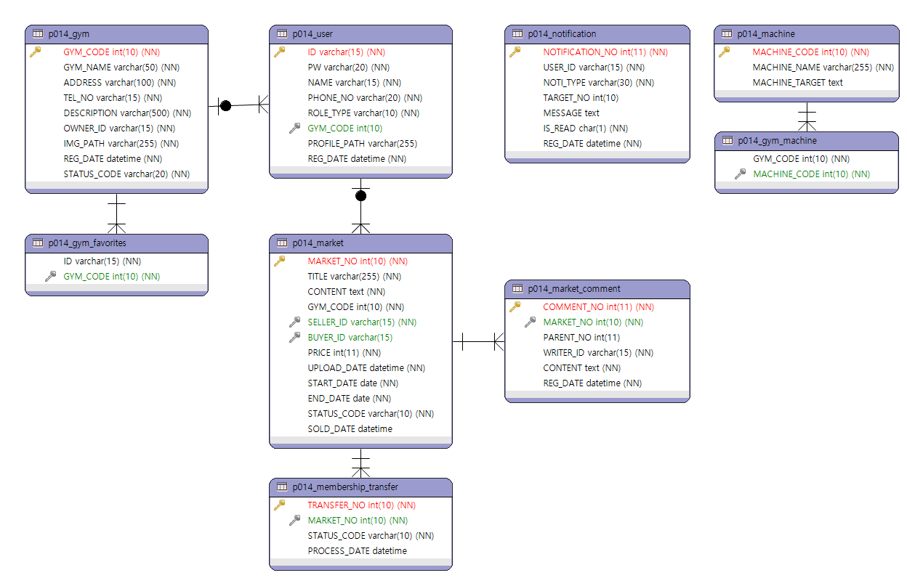

# 🏋️‍♂️ GymBase: 헬스장 정기권 거래 및 관리 플랫폼
> **Nexacro N과 전자정부프레임워크(eGovFrame)를 활용한 기업형 RIA(Rich Internet Application) 구축 프로젝트**

 

## 📅 프로젝트 개요
* **개발 기간:** 2025.07.04 ~ 2025.08.29 (8주)
* **참여 인원:** 1인 개발 (Full Stack)
* **담당 역할:** 기획, DB 설계, UI/UX 설계, 프론트엔드 & 백엔드 개발, 테스트
* **비고:** 개발 과정 커밋 로그는 포함되어 있지 않으며, 최종 산출물 기준으로 업로드했습니다.

---

## 📝 한 줄 요약
**"안전한 헬스장 정기권 거래의 시작"**
헬스장 승인 프로세스를 기반으로 한 **투명한 정기권 마켓**과 체계적인 **회원 관리 서비스**를 통합 제공하는 웹 플랫폼입니다.

---

## 📸 주요 화면 미리보기 (Preview)
**사용자, 헬스장 관리자, 시스템 운영자를 위한 핵심 화면입니다.**

| **사용자 메인 화면** | **정기권 리스트** |
| :---: | :---: |
|  |  |

| **헬스장 거래 관리** | **시스템 관리자 대시보드** |
| :---: | :---: |
|  |  |

---

## 🚀 기획 배경 및 목표
**GymBase**는 헬스장 정기권의 **양도/양수 프로세스**를 시스템화하여 개인 간 거래의 불안요소를 제거하고, 헬스장 운영자에게는 정기권 거래 회원 관리 기능을 제공하기 위해 기획되었습니다.

### 1. 문제점
* **사용자:** 개인 사정으로 사용하지 못한 정기권 처리가 어려워 금전적 손실 발생.
* **헬스장:** 회원 간의 음성적인 양도로 인해 회원 관리의 불투명성 증대.

### 2. 해결책
* **승인 기반 거래 시스템:** `거래 요청` → `헬스장 관리자 승인 (회원 정보 이관)` → `거래 완료` 프로세스 구축.
* **통합 관리 시스템:** 운영자가 승인/반려 권한을 가짐으로써 투명한 회원 관리 가능.

### 3. 기대 효과
* **진입 장벽 최소화:** 저렴한 가격으로 정기권을 구매하여 운동 접근성 향상.
* **손실 최소화:** 판매자는 잔여 기간에 대한 금전적 회수 가능.
* **신규 유입:** 양수자를 신규 정식 회원으로 유치할 기회 제공.

---

## 👥 대상 사용자
| 사용자 유형 | 역할 및 주요 기능 |
| :--- | :--- |
| **일반 사용자 (User)** | 유휴 정기권 판매 및 저렴한 양수, 커뮤니티 활동, 계정 별 알림 |
| **헬스장 관리자 (Gym Owner)** | 소속 회원의 양도 승인/반려, 거래 현황 및 회원 통계 확인 |
| **시스템 관리자 (Admin)** | 신규 헬스장 등록 심사, 플랫폼 전체 데이터 관제 |

---

## 📺 프로젝트 시연 및 발표
**실제 구동 영상과 상세 발표 자료를 통해 프로젝트를 깊이 있게 확인하실 수 있습니다.**

*(위 이미지를 클릭하면 YouTube 영상으로 이동합니다)*

### 📌 주요 기능 타임라인
* **00:00** - 인트로 및 목차
* **00.30** - 프로젝트 개요
* **03.40** - 프로젝트 상세
* **05.36** - 프로젝트 시연
* **06:44** - [시연] 일반 사용자 (회원가입, 정기권 탐색/판매/구매)
* **23:42** - [시연] 헬스장 관리자 (등록 신청 및 승인 프로세스)
* **26:16** - [시연] 시스템 관리자 (대시보드, 헬스장 등록 반려/승인)
* **29:18** - [시연] 헬스장 관리자 (대시보드, 양도권 승인 처리)
* **33:38** - 개발 회고 및 마무리

---

## 🛠 사용 기술 (Tech Stack)

| 구분 | 기술 스택 | 비고 |
| :--- | :--- | :--- |
| **Frontend** |  **JavaScript** | UI/UX 구현, rMateChart 연동 |
| **Backend** |   | MyBatis, Apache Tomcat 9.0 |
| **Database** |  | HeidiSQL |
| **Tools** |  | eGovFrame Dev Tool (Eclipse 기반) |

---

## ✨ 핵심 구현 기술
* **동적 컴포넌트 렌더링 (Dynamic UI):** DB 데이터에 따라 `Div` 및 하위 컴포넌트를 동적으로 생성하여 확장성 있는 리스트 뷰 구현.
* **UX 중심의 상태 관리:** 사용자의 검색 조건, 스크롤 위치 등 `Page History`를 저장하여 화면 전환 시 끊김 없는 사용자 경험 제공.
* **현실적인 비즈니스 로직:** 실제 오프라인 헬스장의 회원권 양도 절차를 분석하여, 플랫폼 내 `승인/반려` 프로세스로 완벽히 이식.
* **데이터 시각화:** `rMateChart`를 활용하여 관리자 대시보드에 직관적인 통계 자료 제공.

---

## 📂 산출물
**현업 수준의 SDLC(소프트웨어 개발 생명주기)를 준수하여 체계적으로 진행했습니다.**
*(각 항목 클릭 시 해당 문서 확인 가능)*

### 1. 프로젝트 관리 (PM)
* [📂 과제수행계획서 (WBS)](./docs/11.기획분석-과제수행%20계획서(WBS)-유지환.xlsx): 일정 준수율 100% (기획 3주, 설계 6주, 개발 4주, 테스트 1주)
* [📂 요구사항 정의서](./docs/10.기획분석-요구사항정의서(유지환).xlsx): 사용자별(User/Owner/Admin) 기능 명세 구체화

### 2. 데이터베이스 설계 (ERD)
* [📂 테이블 정의서](./docs/20.설계-테이블%20정의서(유지환).xlsx): 제3정규형을 준수한 데이터 모델링
* 

### 3. UI/UX 설계
* [📂 프로그램 목록 정의서](./docs/20.설계-프로그램%20목록%20정의서(유지환).xlsx): 프로그램ID 목록 명세 구체화
* [📂 화면 설계서 (SB)](./docs/20.설계-화면설계서(유지환).pptx): SDI(Single Document Interface) 기반의 직관적 구조 설계

### 4. 테스트 (QA)
* [📂 테스트 시나리오 & 결함 리스트](./docs/40.테스트-테스트%20시나리오(유지환).xlsx): 총 **56개**의 Test Case 수행 및 결함 조치 완료

---

## 💡 회고
본 프로젝트는 **기업용 RIA 프레임워크인 Nexacro N**을 처음 도입하여 풀스택 개발을 시도한 도전적인 과제였습니다. 초기 진입 장벽이 있었으나, 프레임워크의 특성을 이해하고 완주함으로써 다음과 같은 성장을 이뤘습니다.

### 📈 성과 및 배운 점
* **SDLC 전체 사이클 경험:** 기획부터 배포, 테스트까지 전 과정을 홀로 수행하며 문서화 능력과 프로젝트 관리 역량을 함양했습니다.
* **Nexacro & 데이터 바인딩 이해:** Nexacro의 강력한 양방향 데이터 바인딩(2-way Binding)을 경험하며, 이는 추후 학습한 Android(Jetpack Compose)의 State 관리 개념을 이해하는 데 큰 밑거름이 되었습니다.
* **표준 프레임워크 적응:** eGovFrame 환경에서의 개발을 통해, 실무에서의 계층 구조(Layered Architecture)의 중요성을 체득했습니다.
* **완성도 향상에 주력:** 단순 기능 구현에 그치지 않고, UX를 위해 고민하며 완성도 높은 결과를 만들기 위해 노력했습니다.

---

## 📞 연락
* **작성자:** 유지환  
* **Email:** applewlghks321@gmail.com